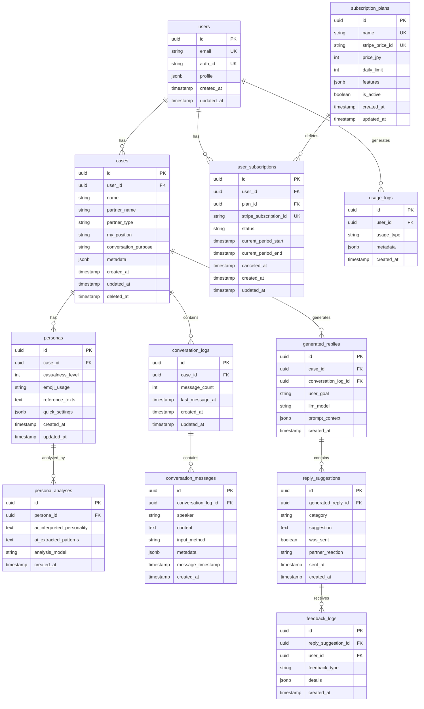

# **Reply Pass データベース設計書 v1.0**

## **目次**
1. [概要](#1-概要)
2. [ER図](#2-er図)
3. [テーブル定義](#3-テーブル定義)
4. [インデックス設計](#4-インデックス設計)
5. [リレーション設計](#5-リレーション設計)
6. [RLS（Row Level Security）設計](#6-rlsrow-level-security設計)
7. [パフォーマンス最適化](#7-パフォーマンス最適化)
8. [マイグレーション戦略](#8-マイグレーション戦略)

## **1. 概要**

### 1.1. データベース選定
- **Supabase** (PostgreSQL 15+)
- **選定理由**:
  - 組み込みの認証機能
  - リアルタイムサブスクリプション
  - 自動生成されるREST API
  - Row Level Security (RLS)
  - エッジファンクション対応

### 1.2. 設計方針
- **正規化レベル**: 第3正規形を基本とし、パフォーマンスを考慮して適度に非正規化
- **命名規則**: snake_case、複数形のテーブル名
- **UUID使用**: 全テーブルの主キーにUUIDv4を使用
- **タイムスタンプ**: created_at, updated_atを全テーブルに付与
- **ソフトデリート**: deleted_atカラムで論理削除を実装

## **2. ER図**



## **3. テーブル定義**

### 3.1. users（ユーザー）
Supabase Authと連携する基本ユーザー情報

| カラム名 | データ型 | NULL | デフォルト | 説明 |
|:---|:---|:---:|:---|:---|
| id | uuid | NO | gen_random_uuid() | 主キー |
| email | varchar(255) | NO | - | メールアドレス（UK） |
| auth_id | varchar(255) | NO | - | Supabase Auth UUID（UK） |
| profile | jsonb | YES | {} | プロフィール情報 |
| created_at | timestamptz | NO | now() | 作成日時 |
| updated_at | timestamptz | NO | now() | 更新日時 |

**profileのJSONB構造**:
```json
{
  "display_name": "田中太郎",
  "avatar_url": "https://...",
  "timezone": "Asia/Tokyo",
  "locale": "ja"
}
```

### 3.2. cases（ケース）
会話の相手・文脈を管理

| カラム名 | データ型 | NULL | デフォルト | 説明 |
|:---|:---|:---:|:---|:---|
| id | uuid | NO | gen_random_uuid() | 主キー |
| user_id | uuid | NO | - | ユーザーID（FK） |
| name | varchar(100) | NO | - | ケース名 |
| partner_name | varchar(100) | NO | - | 相手の名前 |
| partner_type | varchar(50) | YES | - | 相手の属性 |
| my_position | varchar(50) | YES | - | 自分の立場 |
| conversation_purpose | text | YES | - | 会話の目的 |
| metadata | jsonb | YES | {} | その他メタデータ |
| created_at | timestamptz | NO | now() | 作成日時 |
| updated_at | timestamptz | NO | now() | 更新日時 |
| deleted_at | timestamptz | YES | - | 削除日時 |

### 3.3. personas（ペルソナ）
ユーザーの人格・文体情報

| カラム名 | データ型 | NULL | デフォルト | 説明 |
|:---|:---|:---:|:---|:---|
| id | uuid | NO | gen_random_uuid() | 主キー |
| case_id | uuid | NO | - | ケースID（FK） |
| casualness_level | int | NO | 3 | カジュアル度(1-5) |
| emoji_usage | varchar(20) | NO | 'normal' | 絵文字使用頻度 |
| reference_texts | text | YES | - | 参考テキスト(5000文字) |
| quick_settings | jsonb | NO | {} | クイック設定 |
| created_at | timestamptz | NO | now() | 作成日時 |
| updated_at | timestamptz | NO | now() | 更新日時 |

**quick_settingsのJSONB構造**:
```json
{
  "use_honorifics": true,
  "response_length": "medium",
  "thinking_style": "logical",
  "humor_level": 2
}
```

### 3.4. persona_analyses（ペルソナ分析）
AIによる自動分析結果

| カラム名 | データ型 | NULL | デフォルト | 説明 |
|:---|:---|:---:|:---|:---|
| id | uuid | NO | gen_random_uuid() | 主キー |
| persona_id | uuid | NO | - | ペルソナID（FK） |
| ai_interpreted_personality | text | NO | - | AI解釈の性格 |
| ai_extracted_patterns | text | NO | - | AI抽出の言語パターン |
| analysis_model | varchar(50) | NO | - | 使用したLLMモデル |
| created_at | timestamptz | NO | now() | 作成日時 |

### 3.5. conversation_logs（会話ログ）
会話セッションの管理

| カラム名 | データ型 | NULL | デフォルト | 説明 |
|:---|:---|:---:|:---|:---|
| id | uuid | NO | gen_random_uuid() | 主キー |
| case_id | uuid | NO | - | ケースID（FK） |
| message_count | int | NO | 0 | メッセージ数 |
| last_message_at | timestamptz | YES | - | 最終メッセージ日時 |
| created_at | timestamptz | NO | now() | 作成日時 |
| updated_at | timestamptz | NO | now() | 更新日時 |

### 3.6. conversation_messages（会話メッセージ）
個別のメッセージ

| カラム名 | データ型 | NULL | デフォルト | 説明 |
|:---|:---|:---:|:---|:---|
| id | uuid | NO | gen_random_uuid() | 主キー |
| conversation_log_id | uuid | NO | - | 会話ログID（FK） |
| speaker | varchar(20) | NO | - | 発言者(user/assistant) |
| content | text | NO | - | メッセージ内容 |
| input_method | varchar(20) | NO | 'text' | 入力方法 |
| metadata | jsonb | YES | {} | メタデータ |
| message_timestamp | timestamptz | YES | - | メッセージ送信時刻 |
| created_at | timestamptz | NO | now() | 作成日時 |

### 3.7. generated_replies（生成履歴）
返信生成のリクエスト履歴

| カラム名 | データ型 | NULL | デフォルト | 説明 |
|:---|:---|:---:|:---|:---|
| id | uuid | NO | gen_random_uuid() | 主キー |
| case_id | uuid | NO | - | ケースID（FK） |
| conversation_log_id | uuid | NO | - | 会話ログID（FK） |
| user_goal | text | YES | - | ユーザーの目的 |
| llm_model | varchar(50) | NO | - | 使用したLLMモデル |
| prompt_context | jsonb | NO | {} | プロンプトコンテキスト |
| created_at | timestamptz | NO | now() | 作成日時 |

### 3.8. reply_suggestions（返信提案）
生成された返信案

| カラム名 | データ型 | NULL | デフォルト | 説明 |
|:---|:---|:---:|:---|:---|
| id | uuid | NO | gen_random_uuid() | 主キー |
| generated_reply_id | uuid | NO | - | 生成履歴ID（FK） |
| category | varchar(50) | NO | - | カテゴリー |
| suggestion | text | NO | - | 提案内容 |
| was_sent | boolean | NO | false | 送信済みフラグ |
| partner_reaction | varchar(20) | YES | - | 相手の反応 |
| sent_at | timestamptz | YES | - | 送信日時 |
| created_at | timestamptz | NO | now() | 作成日時 |

### 3.9. feedback_logs（フィードバックログ）
ユーザーからのフィードバック

| カラム名 | データ型 | NULL | デフォルト | 説明 |
|:---|:---|:---:|:---|:---|
| id | uuid | NO | gen_random_uuid() | 主キー |
| reply_suggestion_id | uuid | NO | - | 返信提案ID（FK） |
| user_id | uuid | NO | - | ユーザーID（FK） |
| feedback_type | varchar(20) | NO | - | フィードバック種別 |
| details | jsonb | YES | {} | 詳細情報 |
| created_at | timestamptz | NO | now() | 作成日時 |

### 3.10. subscription_plans（サブスクリプションプラン）
料金プランマスタ

| カラム名 | データ型 | NULL | デフォルト | 説明 |
|:---|:---|:---:|:---|:---|
| id | uuid | NO | gen_random_uuid() | 主キー |
| name | varchar(50) | NO | - | プラン名（UK） |
| stripe_price_id | varchar(100) | NO | - | Stripe価格ID（UK） |
| price_jpy | int | NO | - | 月額料金（円） |
| daily_limit | int | NO | - | 1日の生成上限 |
| features | jsonb | NO | {} | 機能設定 |
| is_active | boolean | NO | true | 有効フラグ |
| created_at | timestamptz | NO | now() | 作成日時 |
| updated_at | timestamptz | NO | now() | 更新日時 |

**featuresのJSONB構造**:
```json
{
  "models": ["gemini-2.0-flash", "gemini-2.5-flash"],
  "screenshot_ocr": true,
  "advanced_persona": true,
  "feedback_loop": true
}
```

### 3.11. user_subscriptions（ユーザーサブスクリプション）
ユーザーの契約情報

| カラム名 | データ型 | NULL | デフォルト | 説明 |
|:---|:---|:---:|:---|:---|
| id | uuid | NO | gen_random_uuid() | 主キー |
| user_id | uuid | NO | - | ユーザーID（FK） |
| plan_id | uuid | NO | - | プランID（FK） |
| stripe_subscription_id | varchar(100) | YES | - | StripeサブスクリプションID（UK） |
| status | varchar(20) | NO | - | ステータス |
| current_period_start | timestamptz | NO | - | 現在の期間開始 |
| current_period_end | timestamptz | NO | - | 現在の期間終了 |
| canceled_at | timestamptz | YES | - | キャンセル日時 |
| created_at | timestamptz | NO | now() | 作成日時 |
| updated_at | timestamptz | NO | now() | 更新日時 |

### 3.12. usage_logs（利用ログ）
各種利用履歴

| カラム名 | データ型 | NULL | デフォルト | 説明 |
|:---|:---|:---:|:---|:---|
| id | uuid | NO | gen_random_uuid() | 主キー |
| user_id | uuid | NO | - | ユーザーID（FK） |
| usage_type | varchar(50) | NO | - | 利用種別 |
| metadata | jsonb | NO | {} | メタデータ |
| created_at | timestamptz | NO | now() | 作成日時 |

## **4. インデックス設計**

### 4.1. 主要インデックス

```sql
-- ユーザー関連
CREATE INDEX idx_users_email ON users(email);
CREATE INDEX idx_users_auth_id ON users(auth_id);

-- ケース関連
CREATE INDEX idx_cases_user_id ON cases(user_id) WHERE deleted_at IS NULL;
CREATE INDEX idx_cases_updated_at ON cases(updated_at DESC) WHERE deleted_at IS NULL;

-- ペルソナ関連
CREATE INDEX idx_personas_case_id ON personas(case_id);

-- 会話ログ関連
CREATE INDEX idx_conversation_logs_case_id ON conversation_logs(case_id);
CREATE INDEX idx_conversation_messages_log_id ON conversation_messages(conversation_log_id);
CREATE INDEX idx_conversation_messages_timestamp ON conversation_messages(message_timestamp DESC);

-- 返信生成関連
CREATE INDEX idx_generated_replies_case_id ON generated_replies(case_id);
CREATE INDEX idx_generated_replies_created_at ON generated_replies(created_at DESC);
CREATE INDEX idx_reply_suggestions_generated_id ON reply_suggestions(generated_reply_id);
CREATE INDEX idx_reply_suggestions_sent ON reply_suggestions(was_sent) WHERE was_sent = true;

-- フィードバック関連
CREATE INDEX idx_feedback_logs_suggestion_id ON feedback_logs(reply_suggestion_id);
CREATE INDEX idx_feedback_logs_user_id ON feedback_logs(user_id);

-- サブスクリプション関連
CREATE INDEX idx_user_subscriptions_user_id ON user_subscriptions(user_id);
CREATE INDEX idx_user_subscriptions_status ON user_subscriptions(status) WHERE status = 'active';

-- 利用ログ関連
CREATE INDEX idx_usage_logs_user_created ON usage_logs(user_id, created_at DESC);
CREATE INDEX idx_usage_logs_type_created ON usage_logs(usage_type, created_at DESC);
```

### 4.2. 複合インデックス（パフォーマンス重視）

```sql
-- 日次利用制限チェック用
CREATE INDEX idx_usage_daily_check ON usage_logs(user_id, usage_type, created_at) 
WHERE usage_type = 'reply_generation';

-- フィードバック付き返信取得用
CREATE INDEX idx_suggestions_feedback ON reply_suggestions(generated_reply_id, was_sent, partner_reaction)
WHERE was_sent = true;
```

## **5. リレーション設計**

### 5.1. 外部キー制約

```sql
-- users -> cases
ALTER TABLE cases 
ADD CONSTRAINT fk_cases_user 
FOREIGN KEY (user_id) REFERENCES users(id) ON DELETE CASCADE;

-- cases -> personas
ALTER TABLE personas 
ADD CONSTRAINT fk_personas_case 
FOREIGN KEY (case_id) REFERENCES cases(id) ON DELETE CASCADE;

-- personas -> persona_analyses
ALTER TABLE persona_analyses 
ADD CONSTRAINT fk_analyses_persona 
FOREIGN KEY (persona_id) REFERENCES personas(id) ON DELETE CASCADE;

-- cases -> conversation_logs
ALTER TABLE conversation_logs 
ADD CONSTRAINT fk_logs_case 
FOREIGN KEY (case_id) REFERENCES cases(id) ON DELETE CASCADE;

-- conversation_logs -> conversation_messages
ALTER TABLE conversation_messages 
ADD CONSTRAINT fk_messages_log 
FOREIGN KEY (conversation_log_id) REFERENCES conversation_logs(id) ON DELETE CASCADE;

-- cases & conversation_logs -> generated_replies
ALTER TABLE generated_replies 
ADD CONSTRAINT fk_replies_case 
FOREIGN KEY (case_id) REFERENCES cases(id) ON DELETE CASCADE;

ALTER TABLE generated_replies 
ADD CONSTRAINT fk_replies_log 
FOREIGN KEY (conversation_log_id) REFERENCES conversation_logs(id) ON DELETE CASCADE;

-- generated_replies -> reply_suggestions
ALTER TABLE reply_suggestions 
ADD CONSTRAINT fk_suggestions_reply 
FOREIGN KEY (generated_reply_id) REFERENCES generated_replies(id) ON DELETE CASCADE;

-- reply_suggestions & users -> feedback_logs
ALTER TABLE feedback_logs 
ADD CONSTRAINT fk_feedback_suggestion 
FOREIGN KEY (reply_suggestion_id) REFERENCES reply_suggestions(id) ON DELETE CASCADE;

ALTER TABLE feedback_logs 
ADD CONSTRAINT fk_feedback_user 
FOREIGN KEY (user_id) REFERENCES users(id) ON DELETE CASCADE;

-- users & subscription_plans -> user_subscriptions
ALTER TABLE user_subscriptions 
ADD CONSTRAINT fk_subscriptions_user 
FOREIGN KEY (user_id) REFERENCES users(id) ON DELETE CASCADE;

ALTER TABLE user_subscriptions 
ADD CONSTRAINT fk_subscriptions_plan 
FOREIGN KEY (plan_id) REFERENCES subscription_plans(id);

-- users -> usage_logs
ALTER TABLE usage_logs 
ADD CONSTRAINT fk_usage_user 
FOREIGN KEY (user_id) REFERENCES users(id) ON DELETE CASCADE;
```

## **6. RLS（Row Level Security）設計**

### 6.1. 基本方針
- 認証済みユーザーは自分のデータのみアクセス可能
- カスケード的にアクセス権限を伝播

### 6.2. RLSポリシー実装

```sql
-- Enable RLS on all tables
ALTER TABLE users ENABLE ROW LEVEL SECURITY;
ALTER TABLE cases ENABLE ROW LEVEL SECURITY;
ALTER TABLE personas ENABLE ROW LEVEL SECURITY;
ALTER TABLE persona_analyses ENABLE ROW LEVEL SECURITY;
ALTER TABLE conversation_logs ENABLE ROW LEVEL SECURITY;
ALTER TABLE conversation_messages ENABLE ROW LEVEL SECURITY;
ALTER TABLE generated_replies ENABLE ROW LEVEL SECURITY;
ALTER TABLE reply_suggestions ENABLE ROW LEVEL SECURITY;
ALTER TABLE feedback_logs ENABLE ROW LEVEL SECURITY;
ALTER TABLE user_subscriptions ENABLE ROW LEVEL SECURITY;
ALTER TABLE usage_logs ENABLE ROW LEVEL SECURITY;

-- Users table policies
CREATE POLICY "Users can view own profile" ON users
FOR SELECT TO authenticated
USING (auth.uid()::text = auth_id);

CREATE POLICY "Users can update own profile" ON users
FOR UPDATE TO authenticated
USING (auth.uid()::text = auth_id);

-- Cases table policies
CREATE POLICY "Users can view own cases" ON cases
FOR SELECT TO authenticated
USING (user_id = (SELECT id FROM users WHERE auth_id = auth.uid()::text));

CREATE POLICY "Users can create own cases" ON cases
FOR INSERT TO authenticated
WITH CHECK (user_id = (SELECT id FROM users WHERE auth_id = auth.uid()::text));

CREATE POLICY "Users can update own cases" ON cases
FOR UPDATE TO authenticated
USING (user_id = (SELECT id FROM users WHERE auth_id = auth.uid()::text));

CREATE POLICY "Users can delete own cases" ON cases
FOR DELETE TO authenticated
USING (user_id = (SELECT id FROM users WHERE auth_id = auth.uid()::text));

-- Personas policies (cascade from cases)
CREATE POLICY "Users can access personas of own cases" ON personas
FOR ALL TO authenticated
USING (
  EXISTS (
    SELECT 1 FROM cases 
    WHERE cases.id = personas.case_id 
    AND cases.user_id = (SELECT id FROM users WHERE auth_id = auth.uid()::text)
  )
);

-- Similar cascade policies for other tables...
-- (conversation_logs, conversation_messages, generated_replies, etc.)
```

## **7. パフォーマンス最適化**

### 7.1. パーティショニング戦略

```sql
-- usage_logsを月単位でパーティショニング
CREATE TABLE usage_logs_2024_01 PARTITION OF usage_logs
FOR VALUES FROM ('2024-01-01') TO ('2024-02-01');

CREATE TABLE usage_logs_2024_02 PARTITION OF usage_logs
FOR VALUES FROM ('2024-02-01') TO ('2024-03-01');
-- 以降、自動パーティション作成スクリプトで管理
```

### 7.2. マテリアライズドビュー

```sql
-- 日次利用状況の集計ビュー
CREATE MATERIALIZED VIEW daily_usage_summary AS
SELECT 
  user_id,
  DATE(created_at AT TIME ZONE 'Asia/Tokyo') as usage_date,
  COUNT(*) as generation_count
FROM usage_logs
WHERE usage_type = 'reply_generation'
GROUP BY user_id, usage_date;

CREATE INDEX idx_daily_usage_summary ON daily_usage_summary(user_id, usage_date);

-- 1時間ごとにリフレッシュ
REFRESH MATERIALIZED VIEW CONCURRENTLY daily_usage_summary;
```

### 7.3. クエリ最適化のヒント

```sql
-- 頻繁に実行されるクエリの例と最適化

-- 1. ユーザーの本日の利用回数チェック
EXPLAIN ANALYZE
SELECT COUNT(*) 
FROM usage_logs 
WHERE user_id = ? 
  AND usage_type = 'reply_generation'
  AND created_at >= CURRENT_DATE AT TIME ZONE 'Asia/Tokyo';
-- → idx_usage_daily_checkインデックスを使用

-- 2. ケース一覧取得（最新順）
EXPLAIN ANALYZE
SELECT * FROM cases
WHERE user_id = ? AND deleted_at IS NULL
ORDER BY updated_at DESC
LIMIT 20;
-- → idx_cases_user_idとidx_cases_updated_atを使用
```

## **8. マイグレーション戦略**

### 8.1. バージョン管理
- Supabase CLIを使用したマイグレーション管理
- 各変更を個別のマイグレーションファイルとして管理

### 8.2. マイグレーションファイル構造

```
supabase/migrations/
├── 20240601000001_initial_schema.sql
├── 20240601000002_create_indexes.sql
├── 20240601000003_create_rls_policies.sql
├── 20240602000001_add_feedback_system.sql
└── seed.sql
```

### 8.3. ロールバック戦略

```sql
-- 各マイグレーションに対応するロールバックスクリプト
-- 例: 20240602000001_add_feedback_system_rollback.sql
DROP TABLE IF EXISTS feedback_logs CASCADE;
DROP INDEX IF EXISTS idx_suggestions_feedback;
-- etc...
```

### 8.4. データ移行時の注意点

1. **大量データの移行**
   - バッチ処理で段階的に実行
   - 一時的にインデックスを無効化
   - COPY コマンドの活用

2. **ダウンタイムの最小化**
   - Blue-Greenデプロイメント
   - 読み取り専用モードでの移行

3. **検証手順**
   - ステージング環境での事前テスト
   - データ整合性チェック
   - パフォーマンステスト

---

このデータベース設計書は、Reply Passの全機能を支える堅牢な基盤を提供します。定期的な見直しと最適化により、サービスの成長に対応できる設計となっています。