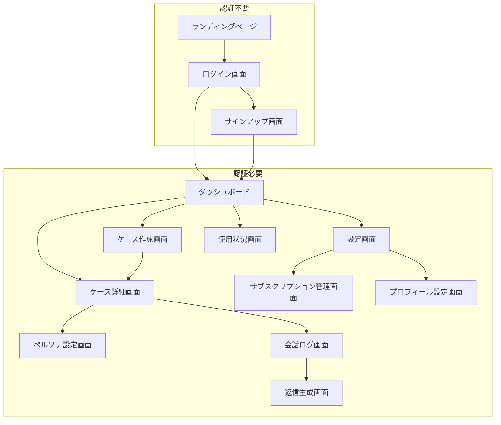

# **Reply Pass 画面設計書 v1.0**

## **目次**
1. [概要](#1-概要)
2. [UI/UX設計方針](#2-uiux設計方針)
3. [画面遷移図](#3-画面遷移図)
4. [画面設計詳細](#4-画面設計詳細)
5. [コンポーネント設計](#5-コンポーネント設計)
6. [レスポンシブデザイン](#6-レスポンシブデザイン)
7. [アクセシビリティ](#7-アクセシビリティ)

## **1. 概要**

### 1.1. 設計範囲
- **全12画面**の詳細設計
- **Next.js 15.3.4 App Router**によるファイルベースルーティング
- **Shadcn/ui (New York style, Zinc)**コンポーネントの活用
- **Tailwind CSS v4 (OKLCH color space)**によるレスポンシブデザイン

### 1.2. 対象デバイス
- **デスクトップ**: 1440px以上（メインターゲット）
- **タブレット**: 768px-1439px
- **スマートフォン**: 320px-767px

### 1.3. サポートブラウザ
- Chrome 100+
- Firefox 100+
- Safari 15+
- Edge 100+

## **2. UI/UX設計方針**

### 2.1. デザインシステム

#### カラーパレット (OKLCH実装済み)
```css
/* Primary Colors */
--primary: oklch(64.6% 0.122 264);        /* #3b82f6 Blue */
--primary-hover: oklch(56.3% 0.197 256);  /* #1d4ed8 Dark Blue */

/* Secondary Colors */
--secondary: oklch(61% 0.122 264);        /* Light Blue */
--secondary-foreground: oklch(11% 0 0);   /* Near Black */

/* Status Colors (実装済み) */
--success: oklch(70.4% 0.191 156);        /* #10b981 Green */
--warning: oklch(74.5% 0.155 83);         /* #f59e0b Orange */
--error: oklch(67.2% 0.227 21);           /* #ef4444 Red */
--info: oklch(64.6% 0.122 264);           /* Primary Blue */

/* Zinc Theme (Shadcn/ui) */
--background: oklch(100% 0 0);            /* White */
--foreground: oklch(14% 0.004 301);       /* Near Black */
--card: oklch(100% 0 0);                  /* White */
--card-foreground: oklch(14% 0.004 301);  /* Near Black */
--border: oklch(91% 0.004 301);           /* Light Gray */
--muted: oklch(96% 0.002 301);            /* Very Light Gray */
--muted-foreground: oklch(45% 0.006 301); /* Medium Gray */
```

#### タイポグラフィ (実装済み)
```css
/* Font Family */
font-family: 'Inter', ui-sans-serif, system-ui, sans-serif;

/* Font Sizes */
--text-xs: 0.75rem;    /* 12px */
--text-sm: 0.875rem;   /* 14px */
--text-base: 1rem;     /* 16px */
--text-lg: 1.125rem;   /* 18px */
--text-xl: 1.25rem;    /* 20px */
--text-2xl: 1.5rem;    /* 24px */
--text-3xl: 1.875rem;  /* 30px */
```

#### スペーシング
```css
/* Spacing Scale */
--space-1: 0.25rem;    /* 4px */
--space-2: 0.5rem;     /* 8px */
--space-3: 0.75rem;    /* 12px */
--space-4: 1rem;       /* 16px */
--space-6: 1.5rem;     /* 24px */
--space-8: 2rem;       /* 32px */
--space-12: 3rem;      /* 48px */
```

### 2.2. UX原則

1. **認知負荷の最小化**
   - 1画面につき1つの主要タスク
   - 階層構造の明確化
   - 一貫性のあるナビゲーション

2. **効率性の追求**
   - ショートカットキーの提供
   - 自動保存機能
   - 予測入力・オートコンプリート

3. **フィードバックの即時性**
   - リアルタイムバリデーション
   - プログレスインジケーター
   - 成功・エラー通知

## **3. 画面遷移図**



## **4. 画面設計詳細**

### 4.1. ランディングページ `/`

#### レイアウト構造
```
┌────────────────────────────────────┐
│ Header (Logo, ナビ, CTA)             │
├────────────────────────────────────┤
│ Hero Section                       │
│ ┌──────────────┐ ┌──────────────┐ │
│ │    見出し     │ │  サンプル動画 │ │
│ │   説明文      │ │      or      │ │
│ │  [無料開始]   │ │  スクリーン   │ │
│ └──────────────┘ └──────────────┘ │
├────────────────────────────────────┤
│ Features Section                   │
│ ┌─────┐ ┌─────┐ ┌─────┐           │
│ │特徴1│ │特徴2│ │特徴3│           │
│ └─────┘ └─────┘ └─────┘           │
├────────────────────────────────────┤
│ Pricing Section                    │
│ ┌─────┐ ┌─────┐ ┌─────┐           │
│ │Free │ │ Pro │ │Unlim│           │
│ └─────┘ └─────┘ └─────┘           │
├────────────────────────────────────┤
│ Footer                             │
└────────────────────────────────────┘
```

#### 主要要素
- **ヘッダー**: ロゴ、ナビゲーション、「ログイン」「無料で始める」ボタン
- **ヒーロー**: キャッチコピー、価値提案、CTA
- **機能紹介**: スクリーンショット入力、ペルソナ、返信生成の3つの特徴
- **料金表**: 3プランの比較表
- **フッター**: 利用規約、プライバシーポリシー、お問い合わせ

### 4.2. ログイン画面 `/auth/login`

#### ワイヤーフレーム
```
┌────────────────────────────────────┐
│              Logo                  │
│                                    │
│         Reply Pass へログイン        │
│                                    │
│ ┌────────────────────────────────┐ │
│ │ メールアドレス              [    ] │ │
│ │ パスワード                  [    ] │ │
│ │ □ ログイン状態を保持する           │ │
│ │                                │ │
│ │ [        ログイン        ]      │ │
│ │                                │ │
│ │ ────── または ──────              │ │
│ │                                │ │
│ │ [ G  Googleでログイン   ]       │ │
│ └────────────────────────────────┘ │
│                                    │
│     パスワードをお忘れですか？        │
│     アカウントをお持ちでない方は      │
│             新規登録                │
└────────────────────────────────────┘
```

#### 機能要件
- メール/パスワード認証
- Google OAuth 2.0
- パスワードリセット
- フォームバリデーション（リアルタイム）
- エラーハンドリング

### 4.3. ダッシュボード `/dashboard`

#### レイアウト構造
```
┌────────────────────────────────────┐
│ Header: Logo | Search | User Menu  │
├─────┬──────────────────────────────┤
│Side │ Main Content Area            │
│Nav  │ ┌──────────────────────────┐ │
│     │ │ Welcome Message          │ │
│     │ │ 今日の利用状況: 3/5回     │ │
│     │ └──────────────────────────┘ │
│     │                              │
│     │ ケース一覧 ┌─── + 新規作成   │
│     │ ┌──────┐┌──────┐┌──────┐   │
│     │ │ケース1││ケース2││ケース3│   │
│     │ │      ││      ││      │   │
│     │ │更新日││更新日││更新日│   │
│     │ └──────┘└──────┘└──────┘   │
│     │                              │
│     │ 最近の生成履歴                │
│     │ ┌──────────────────────────┐ │
│     │ │ 5分前: A社田中様          │ │
│     │ │ 1時間前: 友人Aへの返信    │ │
│     │ │ 昨日: 家族グループチャット │ │
│     │ └──────────────────────────┘ │
└─────┴──────────────────────────────┘
```

#### サイドナビゲーション
- ダッシュボード (現在位置)
- ケース一覧
- 使用状況
- 設定
- ヘルプ・サポート

### 4.4. ケース作成画面 `/cases/new`

#### フォーム設計
```
┌────────────────────────────────────┐
│ ← 戻る    新しいケースを作成         │
├────────────────────────────────────┤
│                                    │
│ ケース名 *                          │
│ ┌────────────────────────────────┐ │
│ │ 例: A社 鈴木様                  │ │
│ └────────────────────────────────┘ │
│                                    │
│ 相手の名前 *                        │
│ ┌────────────────────────────────┐ │
│ │ 例: 鈴木さん                    │ │
│ └────────────────────────────────┘ │
│                                    │
│ 相手の属性（任意）                   │
│ ┌────────────────────────────────┐ │
│ │ 例: 取引先、友人、家族など       │ │
│ └────────────────────────────────┘ │
│                                    │
│ あなたの立場（任意）                 │
│ ┌────────────────────────────────┐ │
│ │ 例: 受注側、後輩、友人など       │ │
│ └────────────────────────────────┘ │
│                                    │
│ この会話の主な目的（任意）            │
│ ┌────────────────────────────────┐ │
│ │ 例: アポ獲得、関係構築など       │ │
│ └────────────────────────────────┘ │
│                                    │
│ 入力精度メーター ████████░░ 80%     │
│                                    │
│    [キャンセル]    [作成する]       │
└────────────────────────────────────┘
```

### 4.5. ケース詳細画面 `/cases/[id]`

#### タブ構成
```
┌────────────────────────────────────┐
│ ← ケース一覧   A社 鈴木様        ⚙️ │
├────────────────────────────────────┤
│ [ペルソナ] [会話ログ] [生成履歴]     │
├────────────────────────────────────┤
│                                    │
│ 現在のペルソナ設定                  │
│ ┌────────────────────────────────┐ │
│ │ カジュアル度: ●●●○○ (3/5)      │ │
│ │ 絵文字使用: 普通                │ │
│ │ 参考テキスト: 500文字登録済み    │ │
│ │                                │ │
│ │ [ペルソナを編集]               │ │
│ └────────────────────────────────┘ │
│                                    │
│ 最近の会話                          │
│ ┌────────────────────────────────┐ │
│ │ 2024/06/01 10:30               │ │
│ │ 相手: お疲れ様です。明日の...      │ │
│ │ あなた: ありがとうございます...    │ │
│ │                [詳細を見る]     │ │
│ └────────────────────────────────┘ │
│                                    │
│ [+ 新しい会話を追加]                │
└────────────────────────────────────┘
```

### 4.6. 会話ログ画面 `/conversations/[id]`

#### チャット風UI
```
┌────────────────────────────────────┐
│ ← 戻る   A社 鈴木様との会話      📊 │
├────────────────────────────────────┤
│                                    │
│ 会話ログ                           │
│ ┌────────────────────────────────┐ │
│ │ ┌─────────────────────┐        │ │
│ │ │ お疲れ様です。明日の会議│ 相手   │ │
│ │ │ の件でご連絡いたします。│ 14:30  │ │
│ │ └─────────────────────┘        │ │
│ │                                │ │
│ │        ┌─────────────────────┐ │ │
│ │   あなた │ ありがとうございます。│ │ │
│ │   14:32  │ 確認いたします。    │ │ │
│ │        └─────────────────────┘ │ │
│ └────────────────────────────────┘ │
│                                    │
│ 会話を追加                          │
│ ┌────────────────────────────────┐ │
│ │ [📷 スクリーンショット] [💬 テキスト] │ │
│ └────────────────────────────────┘ │
│                                    │
│ 返信の目的（任意）                   │
│ ┌────────────────────────────────┐ │
│ │ 例: デートに誘う、謝罪したい...   │ │
│ └────────────────────────────────┘ │
│                                    │
│         [Reply Pass] 🎯            │
└────────────────────────────────────┘
```

### 4.7. 返信生成画面 `/conversations/[id]/generate`

#### 3案提示UI
```
┌────────────────────────────────────┐
│ ← 戻る   返信案を生成中...  ⏱️ 3s   │
├────────────────────────────────────┤
│                                    │
│ 3つの返信案が生成されました          │
│                                    │
│ ┌────────────────────────────────┐ │
│ │ [丁寧] 👍 👎                    │ │
│ │ 承知いたしました。会議室Aで      │ │
│ │ 問題ございません。14時にお...     │ │
│ │              [これを送信した]   │ │
│ └────────────────────────────────┘ │
│                                    │
│ ┌────────────────────────────────┐ │
│ │ [カジュアル] 👍 👎               │ │
│ │ はい、会議室Aで大丈夫です！      │ │
│ │ 14時に伺いますね〜              │ │
│ │              [これを送信した]   │ │
│ └────────────────────────────────┘ │
│                                    │
│ ┌────────────────────────────────┐ │
│ │ [確認重視] 👍 👎                │ │
│ │ 会議室Aで承知しました。念の...   │ │
│ │ ということでよろしいでしょうか？  │ │
│ │              [これを送信した]   │ │
│ └────────────────────────────────┘ │
│                                    │
│        [再生成する] [完了]          │
└────────────────────────────────────┘
```

### 4.8. ペルソナ設定画面 `/cases/[id]/persona`

#### 設定フォーム
```
┌────────────────────────────────────┐
│ ← 戻る   ペルソナ設定               │
├────────────────────────────────────┤
│                                    │
│ クイック設定                        │
│ ┌────────────────────────────────┐ │
│ │ カジュアル度                    │ │
│ │ フォーマル ●●●○○ カジュアル      │ │
│ │                                │ │  
│ │ 絵文字の使用                    │ │
│ │ ○ 使わない ●普通 ○多用         │ │
│ │                                │ │
│ │ 敬語の使用                      │ │
│ │ ●使う ○状況に応じて ○使わない    │ │
│ └────────────────────────────────┘ │
│                                    │
│ スタイルインポート                  │
│ ┌────────────────────────────────┐ │
│ │ あなたの文章をAIに学習させる      │ │
│ │ ┌──────────────────────────┐   │ │
│ │ │ 過去のメッセージや投稿を      │   │ │
│ │ │ コピー＆ペーストしてください  │   │ │
│ │ │                             │   │ │
│ │ │ 残り文字数: 4,500/5,000     │   │ │
│ │ └──────────────────────────┘   │ │
│ │                                │ │
│ │ [📷 画像をアップロード]          │ │
│ └────────────────────────────────┘ │
│                                    │
│    [分析してペルソナを生成] 🤖      │
│                                    │
│       [保存] [リセット]             │
└────────────────────────────────────┘
```

### 4.9. 設定画面 `/settings`

#### タブ構成
```
┌────────────────────────────────────┐
│ 設定                               │
├────────────────────────────────────┤
│ [プロフィール] [サブスクリプション]  │ │
│ [通知] [セキュリティ] [その他]      │
├────────────────────────────────────┤
│                                    │
│ プロフィール情報                    │
│ ┌────────────────────────────────┐ │
│ │ 表示名                          │ │
│ │ ┌──────────────────────────┐   │ │
│ │ │ 田中太郎                    │   │ │
│ │ └──────────────────────────┘   │ │
│ │                                │ │
│ │ メールアドレス                  │ │
│ │ ┌──────────────────────────┐   │ │
│ │ │ tanaka@example.com         │   │ │
│ │ └──────────────────────────┘   │ │
│ │                                │ │
│ │ タイムゾーン                    │ │
│ │ ┌──────────────────────────┐   │ │
│ │ │ Asia/Tokyo ▼              │   │ │
│ │ └──────────────────────────┘   │ │
│ └────────────────────────────────┘ │
│                                    │
│ アカウント管理                      │
│ ┌────────────────────────────────┐ │
│ │ [パスワード変更]                 │ │
│ │ [データエクスポート]             │ │
│ │ [アカウント削除]                 │ │
│ └────────────────────────────────┘ │
└────────────────────────────────────┘
```

### 4.10. サブスクリプション管理画面 `/settings/subscription`

#### プラン比較
```
┌────────────────────────────────────┐
│ サブスクリプション管理              │
├────────────────────────────────────┤
│                                    │
│ 現在のプラン: Free                  │
│ 次回更新: -                        │
│                                    │
│ ┌─────┐ ┌─────┐ ┌─────┐           │
│ │Free │ │ Pro │ │Unlim│           │
│ │ ¥0  │ │¥1280│ │¥3480│           │
│ │     │ │     │ │     │           │
│ │5回/日│ │100回│ │実質 │           │
│ │     │ │ /日 │ │無制限│           │
│ │     │ │     │ │     │           │
│ │現在 │ │アップ│ │アップ│           │
│ │     │ │グレ │ │グレ │           │
│ │     │ │ード │ │ード │           │
│ └─────┘ └─────┘ └─────┘           │
│                                    │
│ お支払い履歴                        │
│ ┌────────────────────────────────┐ │
│ │ 2024/05/01  Pro プラン   ¥1,280 │ │
│ │ 2024/04/01  Pro プラン   ¥1,280 │ │
│ │ 2024/03/01  Pro プラン   ¥1,280 │ │
│ └────────────────────────────────┘ │
│                                    │
│ [解約する] [請求書をダウンロード]    │
└────────────────────────────────────┘
```

### 4.11. 使用状況画面 `/usage`

#### 統計表示
```
┌────────────────────────────────────┐
│ 使用状況                           │
├────────────────────────────────────┤
│                                    │
│ 今日の利用状況                      │
│ ┌────────────────────────────────┐ │
│ │ 返信生成: ████████░░ 8/10回     │ │
│ │ OCR解析:  ██████░░░░ 6/10回     │ │
│ │ リセット: 明日 00:00             │ │
│ └────────────────────────────────┘ │
│                                    │
│ 今月の統計                          │
│ ┌────────────────────────────────┐ │
│ │     生成回数    OCR回数          │ │
│ │ 1週目:  45回      23回          │ │
│ │ 2週目:  52回      28回          │ │
│ │ 3週目:  38回      19回          │ │
│ │ 4週目:  41回      22回          │ │
│ │                                │ │
│ │ 合計:  176回      92回          │ │
│ └────────────────────────────────┘ │
│                                    │
│ よく使うケース Top 3                │
│ ┌────────────────────────────────┐ │
│ │ 1. A社 鈴木様     (32回)        │ │
│ │ 2. 友人グループ   (28回)        │ │
│ │ │ │ 3. 恋人へのメッセージ (24回)   │ │
│ └────────────────────────────────┘ │
└────────────────────────────────────┘
```

### 4.12. エラー画面 `/error`

#### エラーパターン別デザイン

**404 Not Found**
```
┌────────────────────────────────────┐
│              🔍                    │
│                                    │
│       お探しのページが              │
│       見つかりません                │
│                                    │
│   指定されたURLは存在しないか、      │
│   移動された可能性があります。       │
│                                    │
│    [ダッシュボードに戻る]           │
│                                    │
│     困った時は: support@...        │
└────────────────────────────────────┘
```

**500 Internal Server Error**
```
┌────────────────────────────────────┐
│              ⚠️                    │
│                                    │
│       サーバーエラーが              │
│       発生しました                  │
│                                    │
│   一時的な問題の可能性があります。   │
│   しばらく時間をおいて再度          │
│   お試しください。                  │
│                                    │
│        [再読み込み]                │
│                                    │
│   問題が続く場合: support@...      │
└────────────────────────────────────┘
```

## **5. コンポーネント設計**

### 5.1. 共通コンポーネント

#### Button
```typescript
interface ButtonProps {
  variant: 'primary' | 'secondary' | 'outline' | 'ghost'
  size: 'sm' | 'md' | 'lg'
  children: React.ReactNode
  disabled?: boolean
  loading?: boolean
  icon?: React.ReactNode
  onClick?: () => void
}
```

#### Card
```typescript
interface CardProps {
  title?: string
  description?: string
  children: React.ReactNode
  actions?: React.ReactNode
  hover?: boolean
}
```

#### Modal
```typescript
interface ModalProps {
  open: boolean
  onClose: () => void
  title?: string
  children: React.ReactNode
  size?: 'sm' | 'md' | 'lg' | 'xl'
}
```

### 5.2. 業務特化コンポーネント

**実装済みカスタムクラス:**
- `.case-card` - ケースカードのスタイリング（hover効果付き）
- `.reply-card` - 返信提案カードのスタイリング（shadow効果）
- `.status-badge` - ステータス表示バッジ（success/warning/error/info）

#### CaseCard（ケースカード）
```typescript
interface CaseCardProps {
  case: Case
  onSelect: (id: string) => void
  onEdit: (id: string) => void
  onDelete: (id: string) => void
}
```

#### PersonaSettings（ペルソナ設定）
```typescript
interface PersonaSettingsProps {
  persona: Persona
  onChange: (persona: Partial<Persona>) => void
  onAnalyze: () => void
}
```

#### ConversationView（会話表示）
```typescript
interface ConversationViewProps {
  messages: Message[]
  onAddMessage: (message: Message) => void
  onOCRUpload: (files: File[]) => void
}
```

#### ReplyCard（返信カード）
```typescript
interface ReplyCardProps {
  suggestion: ReplySuggestion
  onLike: () => void
  onDislike: () => void
  onSend: () => void
  onFeedback: (reaction: 'positive' | 'negative') => void
}
```

### 5.3. フォームコンポーネント

#### FormField
```typescript
interface FormFieldProps {
  label: string
  error?: string
  required?: boolean
  children: React.ReactNode
  help?: string
}
```

#### FileUpload
```typescript
interface FileUploadProps {
  accept?: string
  multiple?: boolean
  maxSize?: number
  onUpload: (files: File[]) => void
  progress?: number
}
```

### 5.4. フィードバックコンポーネント

#### Toast
```typescript
interface ToastProps {
  type: 'success' | 'error' | 'warning' | 'info'
  title: string
  description?: string
  duration?: number
}
```

#### LoadingSpinner
```typescript
interface LoadingSpinnerProps {
  size?: 'sm' | 'md' | 'lg'
  text?: string
}
```

#### ProgressBar
```typescript
interface ProgressBarProps {
  value: number
  max?: number
  label?: string
  color?: 'primary' | 'success' | 'warning' | 'error'
}
```

## **6. レスポンシブデザイン**

### 6.1. ブレークポイント
```css
/* Tailwind CSS Breakpoints */
sm: 640px
md: 768px
lg: 1024px
xl: 1280px
2xl: 1536px
```

### 6.2. レスポンシブ対応

#### ダッシュボード
- **デスクトップ**: サイドバー + メインコンテンツ
- **タブレット**: 折りたたみサイドバー
- **スマートフォン**: ボトムナビゲーション

#### ケース詳細
- **デスクトップ**: タブレイアウト
- **タブレット**: タブレイアウト（縮小）
- **スマートフォン**: アコーディオン形式

#### 返信生成
- **デスクトップ**: 3カラム横並び
- **タブレット**: 2カラム + 1行
- **スマートフォン**: 縦スタック

### 6.3. タッチ対応
- **最小タッチターゲット**: 44px × 44px
- **スワイプジェスチャー**: 戻る、削除
- **ピンチズーム**: 画像表示時

## **7. アクセシビリティ**

### 7.1. WCAG 2.1 AA準拠

#### 色彩・コントラスト
- **コントラスト比**: 4.5:1以上（通常テキスト）
- **色だけに依存しない**: アイコン併用
- **カラーブラインド**: 判別可能な配色

#### キーボード操作
- **Tab順**: 論理的な順序
- **フォーカス表示**: 明確な視覚的フィードバック
- **ショートカット**: 主要機能へのアクセス

#### スクリーンリーダー
- **セマンティックHTML**: 適切な要素使用
- **aria-label**: 説明的なラベル
- **heading階層**: h1-h6の適切な使用

### 7.2. 実装例

#### セマンティックマークアップ
```html
<main role="main" aria-labelledby="dashboard-title">
  <h1 id="dashboard-title">ダッシュボード</h1>
  
  <section aria-labelledby="cases-title">
    <h2 id="cases-title">ケース一覧</h2>
    <ul role="list">
      <li role="listitem">
        <article aria-labelledby="case-1-title">
          <h3 id="case-1-title">A社 鈴木様</h3>
          <!-- ケース詳細 -->
        </article>
      </li>
    </ul>
  </section>
</main>
```

#### フォーカス管理
```typescript
// モーダル開閉時のフォーカス管理
useEffect(() => {
  if (isOpen) {
    const firstInput = modalRef.current?.querySelector('input');
    firstInput?.focus();
  }
}, [isOpen]);
```

---

この画面設計書は、Reply Passの全12画面の詳細設計を提供しています。開発時はこの設計書に従って、一貫性のあるUI/UXを実現してください。