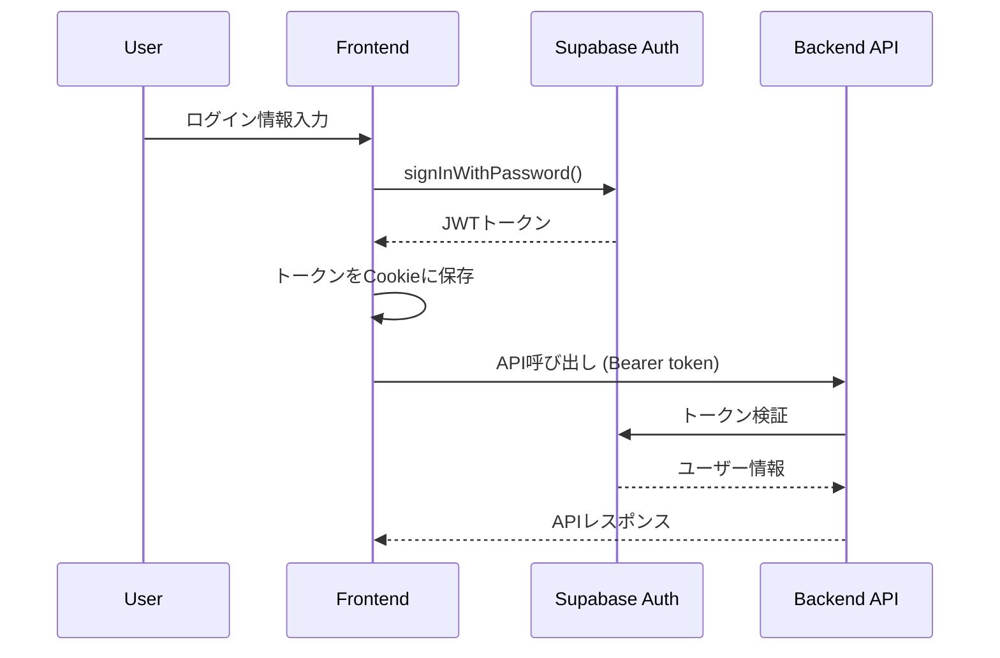
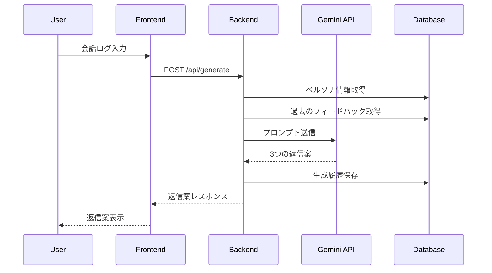

# **Reply Pass (AlterEgo AI) 要件定義書 詳細版 v4.0**

## **目次**
1. [概要](#1-概要)
2. [市場分析とポジショニング](#2-市場分析とポジショニング)
3. [機能要件](#3-機能要件)
4. [技術仕様](#4-技術仕様)
5. [システムアーキテクチャ](#5-システムアーキテクチャ)
6. [データフロー設計](#6-データフロー設計)
7. [セキュリティ設計](#7-セキュリティ設計)
8. [非機能要件](#8-非機能要件)
9. [開発環境](#9-開発環境)
10. [デプロイメント設計](#10-デプロイメント設計)

## **1. 概要**

### 1.1. サービス名
Reply Pass (アルターエゴ AI)

### 1.2. サービスコンセプト
**「AIが、あなたの言葉と心を再現する。」**

### 1.3. コアバリュー
1. **圧倒的な手軽さ**: スクリーンショットを投げ込むだけで会話を記録
2. **究極の自分らしさ**: 独自のペルソナエンジンにより思考のクセまで模倣
3. **無限の応用性**: ケースごとにペルソナを切り替え、あらゆる対人関係をサポート

### 1.4. ターゲットユーザー
- **プライベート**: 友人、恋人、家族とのやり取りで返信に悩む方
- **ビジネスライトユース**: フリーランスや個人事業主

## **2. 市場分析とポジショニング**

### 2.1. 競合分析詳細

| サービス名 | 強み | 弱み | 本サービスの差別化ポイント |
|:---|:---|:---|:---|
| 恋文AI | 恋愛特化で高い訴求力 | ビジネス応用不可、テキスト入力のみ | 全方位対応＋スクリーンショット入力 |
| Rizz AI | スクリーンショット対応 | 人格設定なし、日本語精度に課題 | 高精度な人格トレース＋日本語最適化 |
| Liny | 法人向け高機能 | 高価格、BtoC向けではない | 個人向け価格＋シンプルUX |

### 2.2. 戦略的ポジショニング
- **横軸（対応範囲）**: あらゆる関係に対応（恋愛、友人、家族、ビジネス）
- **縦軸（パーソナライズ度）**: 究極の人格トレース（口調＋思考パターン）

## **3. 機能要件**

### 3.1. 機能一覧

| カテゴリ | 機能ID | 機能名 | 優先度 | MVP | Phase1 | Phase2 |
|:---|:---|:---|:---|:---:|:---:|:---:|
| 認証 | AUTH-001 | メール/パスワード認証 | 高 | ✓ | ✓ | ✓ |
| 認証 | AUTH-002 | Google OAuth | 中 | - | ✓ | ✓ |
| 認証 | AUTH-003 | パスワードリセット | 高 | ✓ | ✓ | ✓ |
| ユーザー管理 | USR-001 | プロフィール管理 | 中 | ✓ | ✓ | ✓ |
| ユーザー管理 | USR-002 | ダッシュボード | 高 | ✓ | ✓ | ✓ |
| ユーザー管理 | USR-003 | 利用状況表示 | 中 | - | ✓ | ✓ |
| ケース管理 | CSE-001 | ケース作成 | 高 | ✓ | ✓ | ✓ |
| ケース管理 | CSE-002 | ケース一覧・切替 | 高 | ✓ | ✓ | ✓ |
| ケース管理 | CSE-003 | ケース編集・削除 | 中 | - | ✓ | ✓ |
| ペルソナ | PER-001 | 基本設定 | 高 | ✓ | ✓ | ✓ |
| ペルソナ | PER-002 | スタイルインポート | 高 | - | ✓ | ✓ |
| ペルソナ | PER-003 | AI自動分析 | 高 | - | - | ✓ |
| 会話ログ | LOG-001 | テキスト入力 | 高 | ✓ | ✓ | ✓ |
| 会話ログ | LOG-002 | スクリーンショット入力 | 高 | - | ✓ | ✓ |
| 会話ログ | LOG-003 | ログ編集 | 中 | - | ✓ | ✓ |
| 返信生成 | GEN-001 | 基本生成 | 高 | ✓ | ✓ | ✓ |
| 返信生成 | GEN-002 | カテゴリー別提案 | 高 | - | ✓ | ✓ |
| 返信生成 | GEN-003 | 対話型リファイン | 中 | - | - | ✓ |
| 返信生成 | GEN-004 | フィードバックループ | 高 | - | - | ✓ |
| 決済 | PAY-001 | Stripe統合 | 高 | - | ✓ | ✓ |
| 決済 | PAY-002 | プラン管理 | 高 | - | ✓ | ✓ |
| 決済 | PAY-003 | 使用量制限 | 高 | ✓ | ✓ | ✓ |

### 3.2. ユーザーストーリー詳細

#### 3.2.1. 新規ユーザーのオンボーディング
1. ランディングページでサービス価値を理解
2. 「無料で始める」をクリック
3. メールアドレスとパスワードで登録（またはGoogle OAuth）
4. 初回ログイン時にガイドツアー表示
5. サンプルケースで機能を体験
6. 本番のケース作成へ誘導

#### 3.2.2. 返信生成の基本フロー
1. ダッシュボードからケースを選択
2. 会話ログを入力（テキストorスクリーンショット）
3. 返信の目的を入力（任意）
4. 「Reply Pass」ボタンをクリック
5. 3つの返信案から選択
6. 必要に応じて再生成
7. 送信後のフィードバックを記録

## **4. 技術仕様**

### 4.1. 技術スタック詳細

#### フロントエンド （実装済み）
```json
{
  "framework": "Next.js 15.3.4 (App Router)",
  "ui": {
    "styling": "Tailwind CSS v4 (OKLCH color space)",
    "components": "Shadcn/ui (New York style, Zinc theme)",
    "icons": "Lucide React 0.523.0"
  },
  "state": {
    "client": "Zustand 5.0.6",
    "server": "TanStack Query v5.81.2"
  },
  "forms": "React Hook Form 7.58.1 + Zod 3.25.67",
  "auth": "@supabase/ssr 0.6.1 + @supabase/supabase-js 2.50.2",
  "payments": "@stripe/stripe-js 7.4.0",
  "typescript": "v5 with strict mode, path aliases",
  "dev_tools": {
    "linter": "ESLint 9 with import ordering",
    "formatter": "Prettier 3.6.1 with Tailwind plugin"
  },
  "testing": {
    "unit": "Jest + React Testing Library (未実装)",
    "e2e": "Playwright (未実装)"
  }
}
```

#### バックエンド （部分実装）
```json
{
  "runtime": "Python 3.11+",
  "framework": "FastAPI 0.109.1",
  "orm": "SQLAlchemy 2.0.23",
  "validation": "Pydantic v2.9.4 + pydantic-settings 2.3.0",
  "auth": "Supabase 2.3.4 (PostgreSQL 15+)",
  "llm": "google-generativeai 0.8.4",
  "payments": "stripe 11.3.0",
  "async": "asyncio + httpx <0.26",
  "testing": "pytest 8.3.4 + pytest-asyncio 0.25.1",
  "dev_tools": {
    "formatter": "Black (未設定)",
    "imports": "isort (未設定)",
    "type_checker": "mypy (未設定)"
  }
}
```

### 4.2. LLM設定詳細

#### モデル選択ロジック
```python
def select_llm_model(user_plan: str, task_type: str) -> str:
    if task_type == "ocr":
        return "gemini-2.5-flash-lite"  # OCR専用
    
    if user_plan == "free":
        return "gemini-2.0-flash"
    elif user_plan == "pro":
        if task_type == "high_quality":
            return "gemini-2.5-flash"
        return "gemini-2.0-flash"
    elif user_plan == "unlimited":
        return "gemini-2.5-flash"  # デフォルトで高品質
```

#### レート制限実装
```python
RATE_LIMITS = {
    "free": {"daily": 5, "per_minute": 1},
    "pro": {"daily": 100, "per_minute": 5},
    "unlimited": {"daily": 1000, "per_minute": 20}
}
```

### 4.3. プロンプトエンジニアリング詳細

#### ペルソナ分析プロンプト
```python
PERSONA_ANALYSIS_PROMPT = """
以下のテキストサンプルから、筆者の特徴を分析してください。

# 分析項目
1. 性格・価値観
   - 基本的な性格特性（外向的/内向的、論理的/感情的など）
   - 重視する価値観
   - コミュニケーションスタイル

2. 言語的特徴
   - よく使う表現・口癖
   - 文体（です・ます調/だ・である調/カジュアル）
   - 絵文字・顔文字の使用傾向
   - 句読点の使い方

3. 思考パターン
   - 論理展開の特徴
   - 話題の選び方
   - 相手への配慮の仕方

# サンプルテキスト
{sample_text}

# 出力形式
JSON形式で、各項目を構造化して出力してください。
"""
```

#### OCRプロンプト
```python
OCR_PROMPT = """
これはチャットアプリのスクリーンショットです。
以下の手順で会話を抽出してください：

1. 画像内のすべてのテキストを読み取る
2. 発言者を識別する
   - 吹き出しの位置（左/右）
   - アイコンや名前の表示
   - 既読マークの位置
3. タイムスタンプを保持
4. 絵文字や特殊文字も正確に抽出

# 出力形式
{
  "messages": [
    {
      "speaker": "user" | "assistant",
      "content": "メッセージ内容",
      "timestamp": "HH:MM" (存在する場合)
    }
  ]
}
"""
```

## **5. システムアーキテクチャ**

### 5.1. 全体構成図

```
┌─────────────────┐     ┌─────────────────┐     ┌─────────────────┐
│                 │     │                 │     │                 │
│  Next.js App    │────▶│  FastAPI        │────▶│  Supabase       │
│  (Vercel)       │     │  (Ubuntu VPS)   │     │  (PostgreSQL)   │
│                 │     │                 │     │                 │
└─────────────────┘     └─────────────────┘     └─────────────────┘
         │                       │                       │
         │                       │                       │
         ▼                       ▼                       ▼
┌─────────────────┐     ┌─────────────────┐     ┌─────────────────┐
│  Stripe         │     │  Gemini API     │     │  Supabase       │
│  (Payments)     │     │  (LLM)          │     │  Storage        │
└─────────────────┘     └─────────────────┘     └─────────────────┘
```

### 5.2. API設計原則

#### RESTful設計
- リソース指向URL設計
- 適切なHTTPメソッドの使用
- ステータスコードの標準準拠

#### エラーレスポンス形式
```json
{
  "error": {
    "code": "RESOURCE_NOT_FOUND",
    "message": "指定されたケースが見つかりません",
    "details": {
      "case_id": "123e4567-e89b-12d3-a456-426614174000"
    }
  }
}
```

### 5.3. フロントエンドアーキテクチャ

#### ディレクトリ構造
```
frontend/
├── app/
│   ├── (marketing)/        # 公開ページ
│   │   ├── page.tsx        # ランディング
│   │   └── pricing/        # 料金ページ
│   ├── (app)/              # 認証必須ページ
│   │   ├── dashboard/      # ダッシュボード
│   │   ├── cases/          # ケース管理
│   │   └── settings/       # 設定
│   └── api/
│       └── stripe/         # Stripe webhook
├── components/
│   ├── ui/                 # Shadcn/ui
│   ├── features/           # 機能別コンポーネント
│   └── layouts/            # レイアウト
├── lib/
│   ├── supabase.ts
│   ├── stripe.ts
│   └── api-client.ts
└── hooks/
    ├── use-auth.ts
    └── use-cases.ts
```

### 5.4. デザインシステム（実装済み）

#### カラーパレット（OKLCH色空間）
```css
/* Primary Colors */
--primary: oklch(64.6% 0.122 264);        /* Blue #3b82f6 */
--primary-hover: oklch(56.3% 0.197 256);  /* Dark Blue #1d4ed8 */

/* Secondary Colors */  
--secondary: oklch(61% 0.122 264);        /* Light Blue */

/* Status Colors */
--success: oklch(70.4% 0.191 156);        /* Green #10b981 */
--warning: oklch(74.5% 0.155 83);         /* Orange #f59e0b */
--error: oklch(67.2% 0.227 21);           /* Red #ef4444 */

/* Zinc Theme (Shadcn/ui) */
--background: oklch(100% 0 0);            /* White */
--foreground: oklch(14% 0.004 301);       /* Near Black */
--border: oklch(91% 0.004 301);           /* Light Gray */
--muted: oklch(96% 0.002 301);            /* Very Light Gray */
--muted-foreground: oklch(45% 0.006 301); /* Medium Gray */
```

#### カスタムコンポーネントクラス
```css
/* ケースカード */
.case-card {
  @apply bg-card border border-border rounded-lg p-6 shadow-sm 
         hover:shadow-lg transition-all duration-200;
}

/* 返信提案カード */
.reply-card {
  @apply bg-card border border-border rounded-lg p-4 shadow-sm 
         hover:shadow-md transition-shadow;
}

/* ステータスバッジ */
.status-badge {
  @apply inline-flex items-center rounded-full px-2.5 py-0.5 
         text-xs font-medium;
}
.status-badge.success { @apply bg-success/10 text-success; }
.status-badge.warning { @apply bg-warning/10 text-warning; }
.status-badge.error { @apply bg-error/10 text-error; }
.status-badge.info { @apply bg-primary/10 text-primary; }
```

#### タイポグラフィ
```css
/* Font Family */
font-family: 'Inter', ui-sans-serif, system-ui, sans-serif;

/* Font Sizes (Tailwind v4) */
--text-xs: 0.75rem;    /* 12px */
--text-sm: 0.875rem;   /* 14px */
--text-base: 1rem;     /* 16px */
--text-lg: 1.125rem;   /* 18px */
--text-xl: 1.25rem;    /* 20px */
--text-2xl: 1.5rem;    /* 24px */
--text-3xl: 1.875rem;  /* 30px */
--text-4xl: 2.25rem;   /* 36px */
```

## **6. データフロー設計**

### 6.1. 認証フロー



### 6.2. 返信生成フロー



## **7. セキュリティ設計**

### 7.1. 認証・認可

#### Supabase RLS実装
```sql
-- ユーザーは自分のデータのみアクセス可能
CREATE POLICY "Users can only access own data"
ON cases
FOR ALL
TO authenticated
USING (auth.uid() = user_id);

-- ケースに紐づくデータも同様に保護
CREATE POLICY "Access own case data"
ON conversation_logs
FOR ALL
TO authenticated
USING (
  EXISTS (
    SELECT 1 FROM cases
    WHERE cases.id = conversation_logs.case_id
    AND cases.user_id = auth.uid()
  )
);
```

### 7.2. データ保護

#### 暗号化戦略
- **転送時**: HTTPS/TLS 1.3
- **保存時**: Supabase透過的暗号化 + アプリケーションレベル暗号化（機密データ）

#### 機密データの定義
- 会話ログの内容
- ペルソナの参考テキスト
- フィードバックデータ

### 7.3. APIセキュリティ

#### レート制限実装
```python
from fastapi_limiter import FastAPILimiter
from fastapi_limiter.depends import RateLimiter

@app.post("/api/generate", dependencies=[Depends(RateLimiter(times=5, seconds=60))])
async def generate_reply():
    # プランに応じた追加制限
    pass
```

#### 入力検証
```python
from pydantic import BaseModel, validator

class GenerateRequest(BaseModel):
    case_id: UUID
    goal: Optional[str] = Field(None, max_length=200)
    
    @validator('goal')
    def validate_goal(cls, v):
        if v and len(v.strip()) == 0:
            raise ValueError('目的が空白です')
        return v
```

## **8. 非機能要件**

### 8.1. パフォーマンス要件

| 指標 | 目標値 | 測定方法 |
|:---|:---|:---|
| ページロード時間 | < 2秒 (P95) | Lighthouse |
| API応答時間 | < 500ms (P95) | APMツール |
| 返信生成時間 | < 8秒 (P95) | カスタムメトリクス |
| 同時接続数 | 1000ユーザー | 負荷テスト |

### 8.2. 可用性要件

- **目標稼働率**: 99.9%（月間43分以内のダウンタイム）
- **災害復旧**: 24時間以内
- **バックアップ**: 日次自動バックアップ、30日間保持

### 8.3. 拡張性要件

- **水平スケーリング**: Kubernetes対応を想定した設計
- **データベース**: Supabaseの自動スケーリング機能を活用
- **CDN**: Vercel Edge Networkによる静的アセット配信

## **9. 開発環境**

### 9.1. 必要なツール

```bash
# 必須ツール
- Node.js 20.x LTS
- Python 3.11+
- Docker & Docker Compose
- Git

# 推奨エディタ
- VS Code with extensions:
  - ESLint
  - Prettier
  - Python
  - Tailwind CSS IntelliSense
```

### 9.2. 環境変数設定

#### Frontend (.env.local)
```bash
NEXT_PUBLIC_SUPABASE_URL=
NEXT_PUBLIC_SUPABASE_ANON_KEY=
NEXT_PUBLIC_STRIPE_PUBLISHABLE_KEY=
NEXT_PUBLIC_API_URL=http://localhost:8000
```

#### Backend (.env)
```bash
SUPABASE_URL=
SUPABASE_SERVICE_KEY=
GEMINI_API_KEY=
STRIPE_SECRET_KEY=
STRIPE_WEBHOOK_SECRET=
DATABASE_URL=
REDIS_URL=
```

## **10. デプロイメント設計**

### 10.1. CI/CDパイプライン

```yaml
# .github/workflows/deploy.yml
name: Deploy
on:
  push:
    branches: [main]

jobs:
  test:
    runs-on: ubuntu-latest
    steps:
      - uses: actions/checkout@v3
      - name: Run tests
        run: |
          npm test
          python -m pytest

  deploy-frontend:
    needs: test
    runs-on: ubuntu-latest
    steps:
      - name: Deploy to Vercel
        uses: vercel/action@v1
        with:
          vercel-token: ${{ secrets.VERCEL_TOKEN }}

  deploy-backend:
    needs: test
    runs-on: ubuntu-latest
    steps:
      - name: Deploy to VPS
        uses: appleboy/ssh-action@v0.1.5
        with:
          host: ${{ secrets.VPS_HOST }}
          script: |
            cd /app
            git pull
            docker-compose up -d --build
```

### 10.2. 監視・ログ設計

#### 監視項目
- **アプリケーション**: エラー率、レスポンスタイム
- **インフラ**: CPU使用率、メモリ使用率、ディスク容量
- **ビジネス**: 新規登録数、返信生成数、課金成功率

#### ログ設計
```python
import structlog

logger = structlog.get_logger()

# 構造化ログの例
logger.info(
    "reply_generated",
    user_id=user_id,
    case_id=case_id,
    model=selected_model,
    duration_ms=duration,
    suggestion_count=3
)
```

### 10.3. 本番環境チェックリスト

- [ ] SSL証明書の設定
- [ ] WAFの設定
- [ ] データベースバックアップの確認
- [ ] 監視アラートの設定
- [ ] ログローテーションの設定
- [ ] レート制限の本番値設定
- [ ] 環境変数の本番値設定
- [ ] Stripeの本番キー設定
- [ ] エラー通知（Sentry等）の設定
- [ ] パフォーマンス監視の設定

---

この詳細版要件定義書は、Claude Codeが開発を進める際の完全なリファレンスとして機能します。各セクションは独立して参照可能であり、実装時の疑問をすべて解決できるよう設計されています。